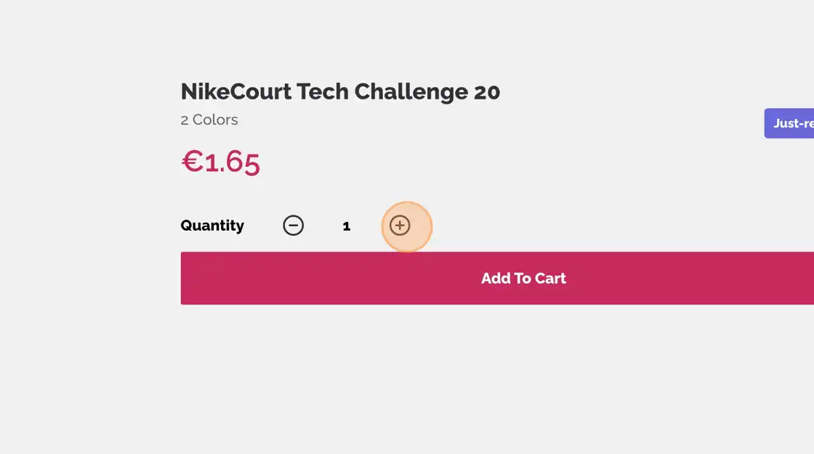
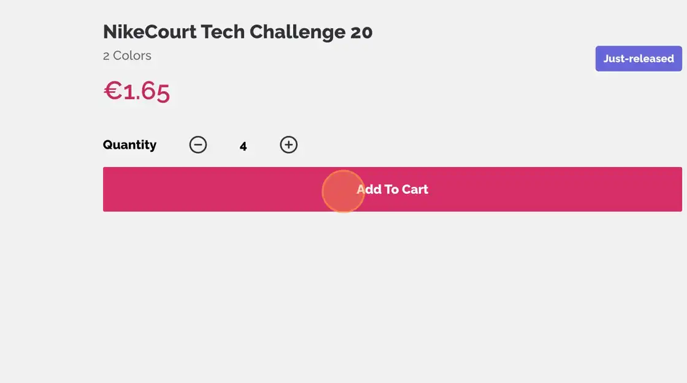
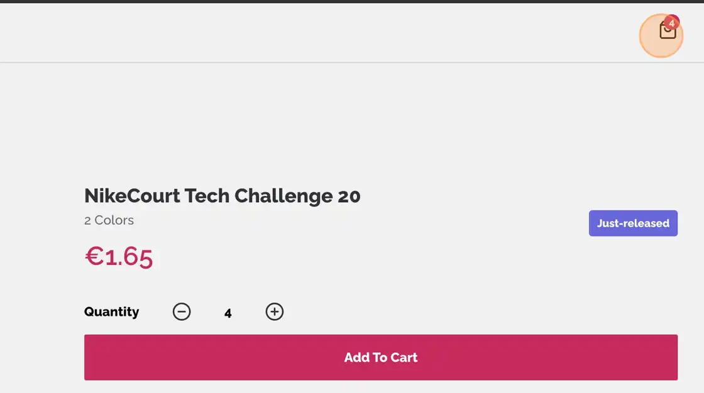
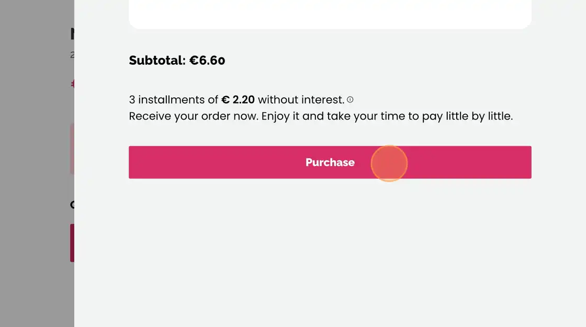
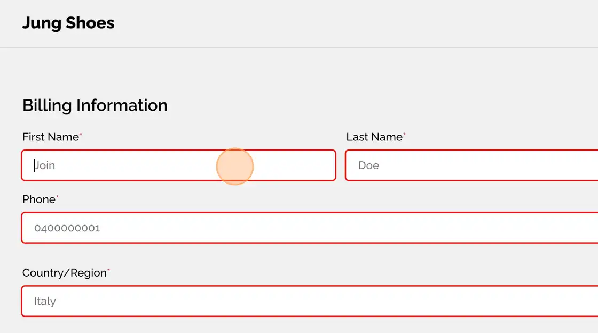
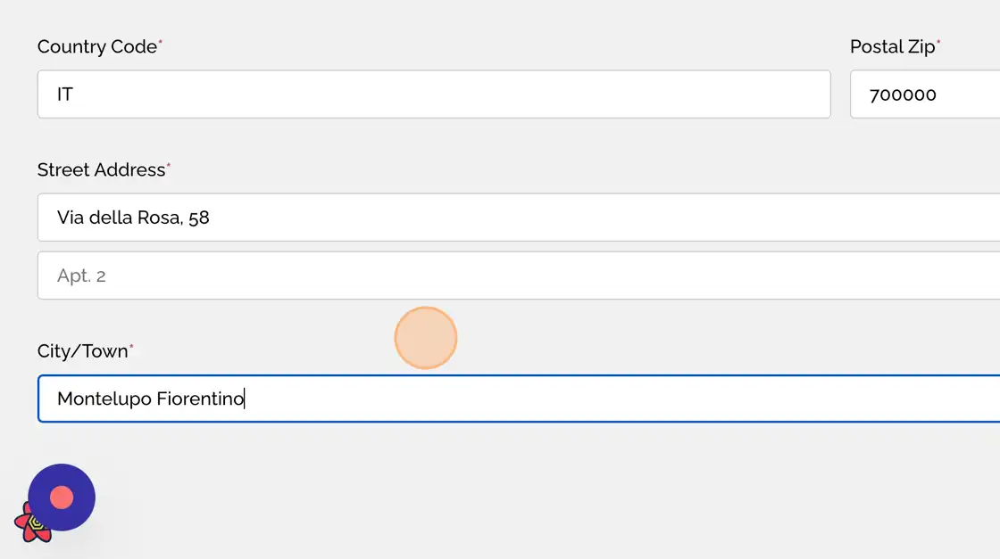
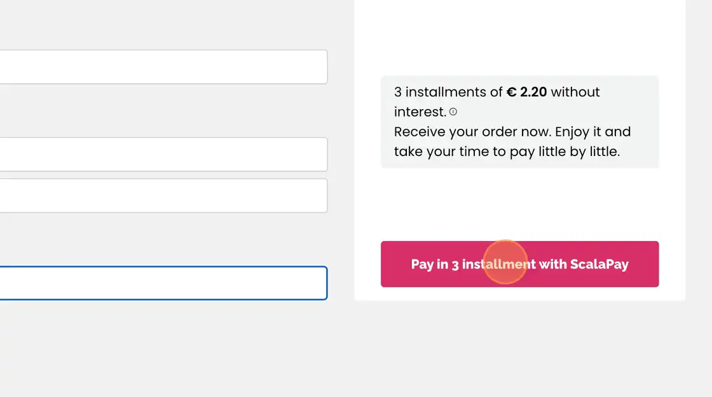
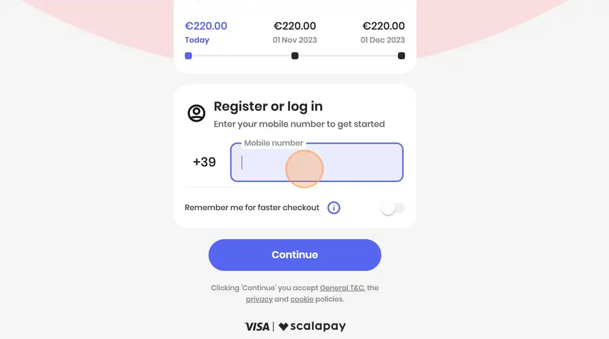
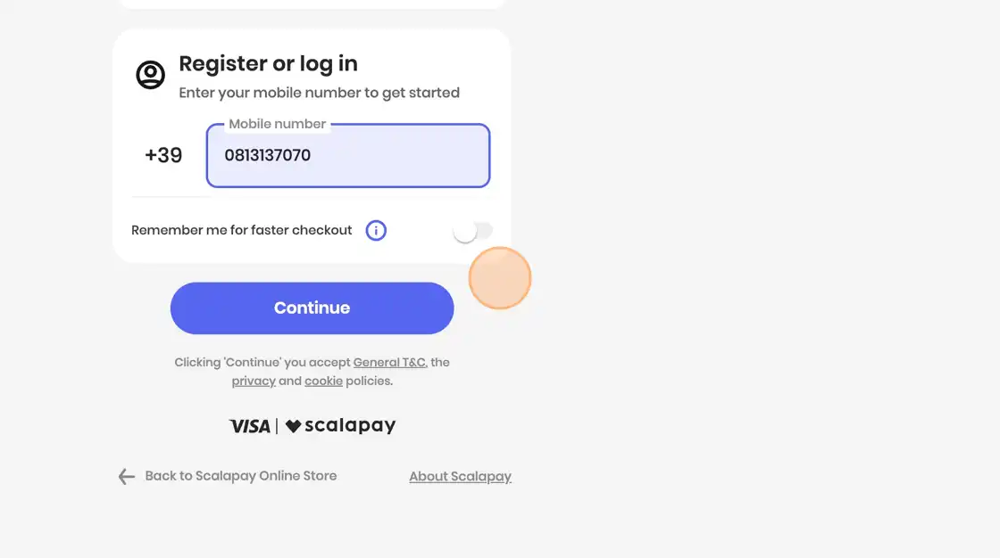

# Jung Talents Coding Assignment

## Overview

This is a solution to the [E-commerce product page using the 3rd party API]

## Key Features:

Users are able to:

- Browsing the products's gallery on the Home page and viewing the responsive layout depending on their device's screen size
- See hover states for all interactive elements on the page
- Change the quantity of product by clicking on the small plus or minus icons button
- Add items to the cart
- Open an overlay sidebar containing the product in the cart by clicking on the shopping bag icon on the left corner of the site
- View the cart and remove items from it
- Navigate to the checkout page by clicking on the Checkout Button
- Fill in the form with all required billing and shipping info in order to proceed with the order

## Installation

Clone this repo and install all dependencies

```
git clone https://github.com/Antonio0402/jung-talents-coding-asignment.git

cd jung-talents-coding-asignment
```

Install the dependecies and start the local dev server of client site from dir `jung-talents-coding-asignment`

```
cd client

npm install

npm run dev
```

Open new terminal and move to directory of `jung-talents-coding-asignment` then install the dependecies and start the local dev server of server/api site

```
cd jung-talents-coding-asignment

cd api

npm install

npm run dev
```

## Commands

All commands are run from both client and server of the project, from a terminal:

| Command             | Action                                              |
| :------------------ | :-------------------------------------------------- |
| `npm install`       | Installs dependencies                               |
| `npm run dev`       | Starts local dev server at `localhost:port`         |
| `npm run build`     | Build your production site on destination dir       |
| `npm run preview`   | Preview your client build locally, before deploying |
| `npm run start ...` | Preview your server build locally, before deploying |

### Screenshot

#### Click on the product image to view product details while navigate to new page


#### Click the plus or minus icon to change the quantity of merchandise



#### When finished. Click "Add To Cart" button



#### Open the cart sidebar by clicking on the shopping bag icon



#### Confirm the total price and quantity before going Checkout when clicking on "Purchase" button



#### Fill in all the required input of shipping and billing info



#### All information with a red asterisk label next-to must be not empty and essential for checkout process



#### When completely filling in. Click "Pay in 3 installment with ScalaPay" button to create an order with ScalaPay



### User will be navigate to a payment portal of ScalaPay



### Proceed as requested for checkout and click "Continue


